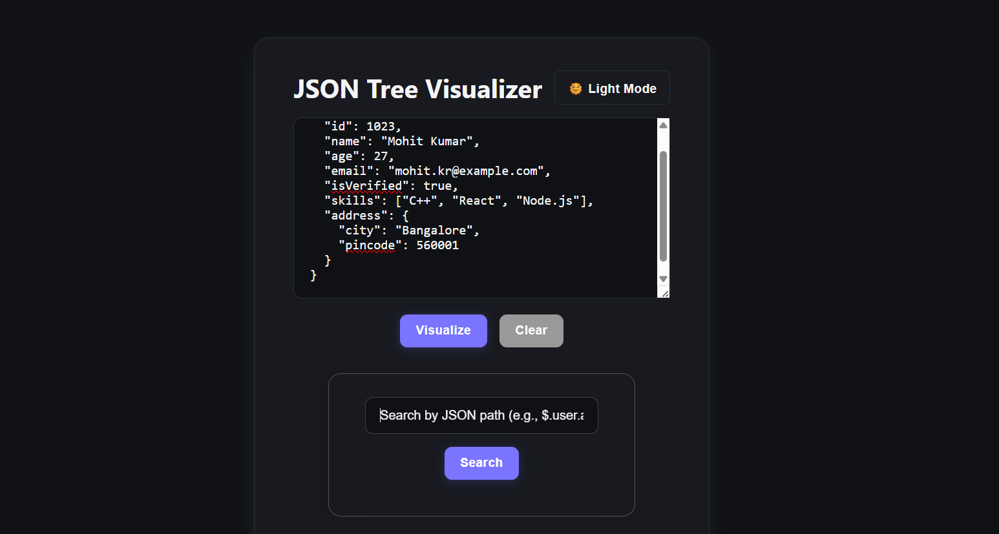
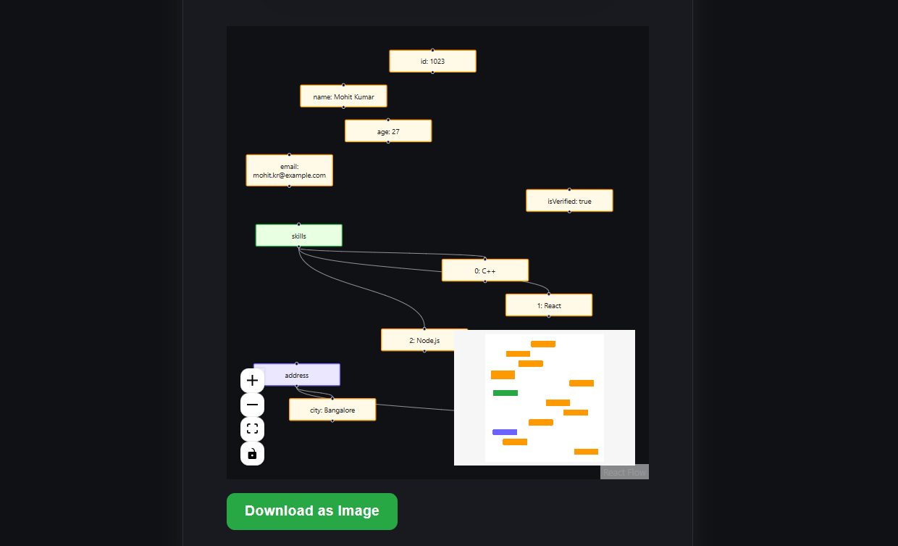
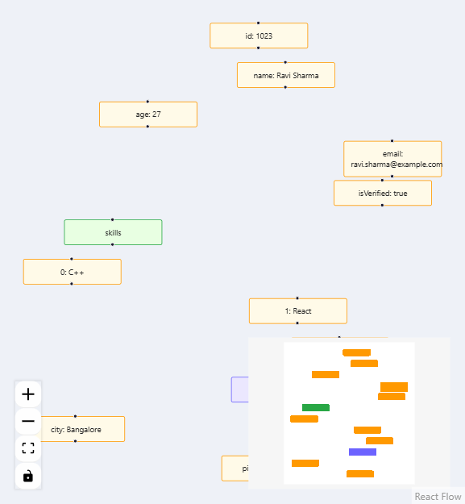

# JSON Tree Visualizer

An interactive web application to visualize any JSON data as a hierarchical tree, featuring real-time search, highlighting, and theme toggle. Built for APIWIZ Frontend SDE Role Assignment (SDE-I).

---

## Objective

Visualize, inspect, and search through any JSON data interactively. See nested objects, arrays, and primitive values as a connected node tree, instantly search by path, and explore with fluid UX.

---

## Features

- **JSON Input & Parsing**  
  - Paste/write JSON in a text area  
  - Live validation & error feedback  
  - Sample JSON placeholder

- **Tree Visualization with React Flow**  
  - Hierarchy using connected nodes  
  - Visual distinction for Objects, Arrays, Primitives  
  - Colors for fast recognition  
  - Parent-child relationships via edges

- **Advanced Search**  
  - Search via JSON path (`$.user.address.city`, `items[0].name`, etc.)  
  - Instant highlighting and centering on match  
  - Match found / not found feedback

- **Basic Interactivity**  
  - Zoom In/Out/Fit View  
  - Pan canvas  
  - Node info tooltip (path/value) on hover

- **Bonus**  
  - Dark/Light mode toggle  
  - Clear/Reset button  
  - Copy node path by clicking  
  - Download tree as an image

---

## Demo Screenshot

---

## Tech Stack

- React
- [React Flow](https://reactflow.dev/) for node-based tree visualization
- CSS variables for theming

---

## Getting Started

# Clone the repo
git clone https://github.com/mohit1721/json-visualizer.git
cd json-tree-visualizer

# Install dependencies
npm install

# Start development server
npm start

Open [http://localhost:3000](http://localhost:3000) to use the app.

---

## Usage

1. Paste or type your JSON into the input area.  
2. Click **Visualize** to generate the tree.  
3. Use the **Search Bar** to enter a path (e.g. `$.data.user.name`).  
4. See all matches highlighted and auto-centered.  
5. Toggle theme, zoom, clear all, or copy any path.

---

## Design Reference

- The UI is flexible! Use your own design sense; major features prioritized for function and usability.
- Example:

---

##  Code Structure

- `/src/components`: Modular components – JsonInput, TreeVisualizer, SearchBar, etc.
- `/src/utils`: Utils – jsonToTree, searchtree.
- `/src/index.css`: Theme, layout, and responsive rules
- `/src/App.js`: Main glue code 

---

## Contributing

Pull requests and issue reports welcome! For improvements, add clean commits and document your changes.

---

##  Assignment Details

- **Assignment:** APIWIZ Frontend SDE Role
- **Requirements:** See [[Assignment Description](https://docs.google.com/document/d/1cKgRcSS2s1jCEQeCzW5IqpfRl3gb__YJQE9Z2totdrY/edit?tab=t.0)]
- **Deadline:** 30th Oct, 2025 - 10:00 PM

## Evaluation Criteria

- UI/UX and Responsiveness
- Code Quality & Readability
- Creative use of React Flow 
- Bonus features = more points!

---

## License

MIT

---

> **Note:** This solution was independently built. No AI tools were used as per assignment requirements.  
> All assignment requirements for error handling, visualization, and search were fulfilled (solution tested and working).

